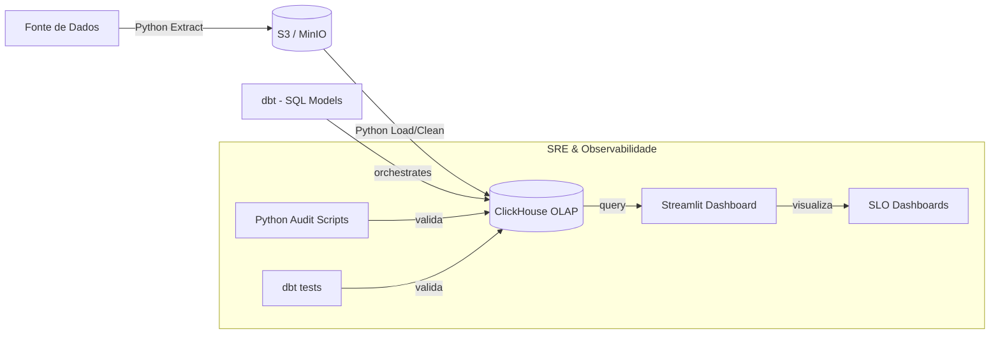

# System Design

## 1. Diagrama de Fluxo (Mermaid)

## 2. Narrativa do Design
O sistema utiliza o **Streamlit** como sua camada de visualização primária. 

A escolha do Streamlit (Python) em vez de ferramentas de BI tradicionais permite uma integração profunda com o ecossistema SRE do projeto. Os dashboards não apenas mostram vendas, mas também o status de integridade dos dados, resultados dos `dbt tests` e métricas de SLO em tempo real, tudo codificado em Python puro. O Streamlit consome os dados diretamente das camadas Curated do **ClickHouse**, garantindo que a visualização seja sempre baseada na "Single Source of Truth".
