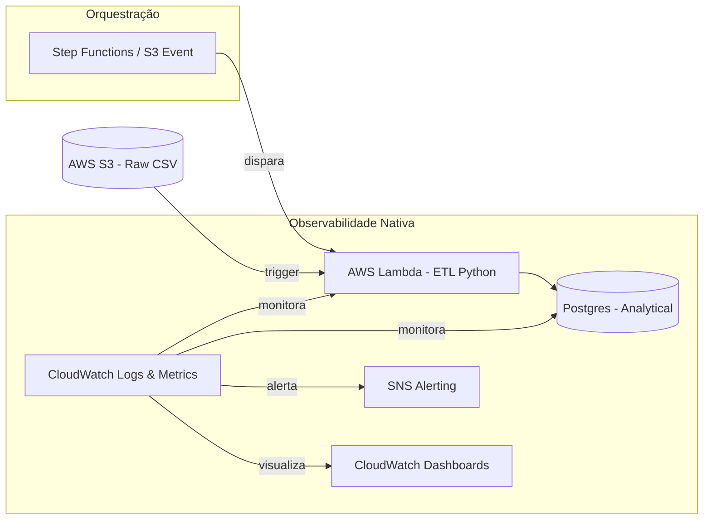

# System Design

## 1. Diagrama de Fluxo (Mermaid)

## 2. Narrativa do Design
O sistema foi otimizado para **baixo esforço de desenvolvimento** e alta eficiência de custo usando uma arquitetura **Serverless**. A ingestão é disparada automaticamente quando um novo arquivo chega ao S3 (**S3 Event Trigger**) ou através de um fluxo do **Step Functions**.

O processamento é realizado por **AWS Lambdas** escritas em Python. Esta abordagem elimina a necessidade de configurar servidores, gerenciar Dockerfiles complexos ou se preocupar com escalabilidade de infraestrutura, permitindo focar exclusivamente na lógica de transformação de dados e nas regras de negócio. A estratégia de carga permanece com `upsert` no Postgres, garantindo integridade e idempotência de forma simples e direta.
