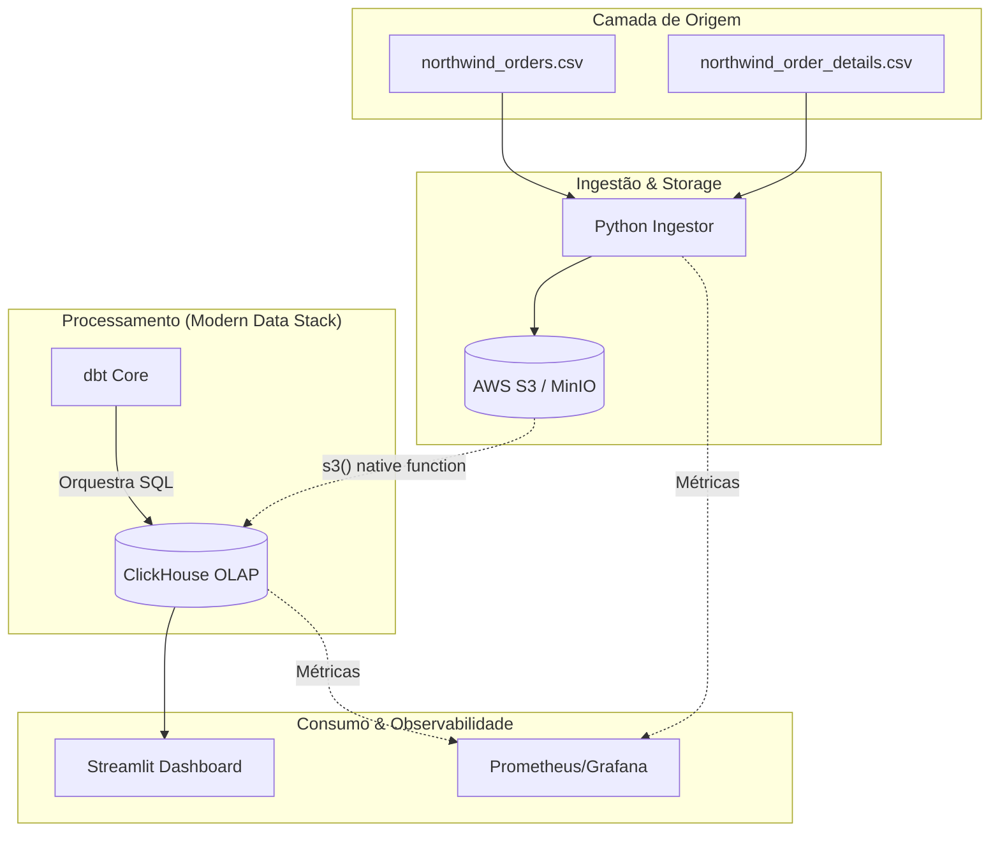
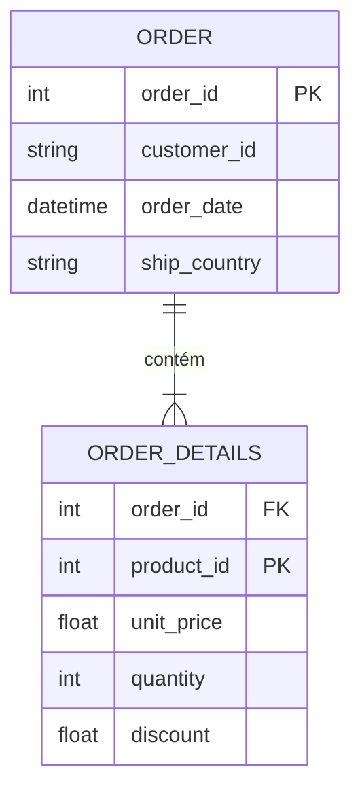
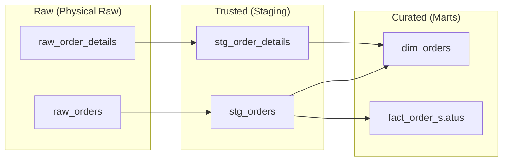

# System Design & Technical Narrative

## Design Principles (BASS & ATAM Alignment)

> **⚠️ Contexto importante:** O modelo de dados real consiste em duas tabelas relacionadas (**Orders** e **Order Details**) no S3. O design abaixo reflete esta estrutura relacional processada via Medallion Architecture.

O design deste sistema foi guiado pelos princípios de **Software Architecture in Practice (Bass)**, focando em Atributos de Qualidade (QAs), e validado através de considerações **ATAM** para equilibrar tradeoffs técnicos.

### 1. Estratégia de Ingestão (Performance & Testability)
Utilizamos o padrão **S3-as-a-Buffer**. O script Python orquestra a carga, garantindo que os dados brutos sejam movidos para o S3 antes de serem ingeridos pelo ClickHouse via `s3()` function nativa.
- **BASS**: Foco em *Performance*. A ingestão nativa do ClickHouse é ordens de magnitude mais rápida que inserts linha a linha via Python.
- **ATAM Tradeoff**: Sacrificamos a flexibilidade de pré-processamento pesado em Python em favor da velocidade bruta de carga.

### 2. Camadas de Dados (Modifiability & Reliability)
- **Raw (Landing)**: CSVs originais no S3 (`raw/northwind_orders.csv` e `raw/northwind_order_details.csv`).
- **Trusted (Staging)**: Onde o dbt realiza o cast de tipos, renomeia colunas e aplica limpezas básicas (`stg_orders`, `stg_order_details`).
- **Curated (Analytics)**: Modelos enriquecidos prontos para o BI (`dim_orders`, `fact_order_status`).

---

## 1. Diagrama de Arquitetura da Stack

---

## 2. Modelagem de Dados

### 2.1. Modelo Conceitual
Representação das entidades de negócio e seus relacionamentos.

### 2.2. Modelo Lógico (Arquitetura Medallion)
Fluxo de transformação dos dados através das camadas.

### 2.3. Modelo Físico (ClickHouse)
Especificação técnica das tabelas no banco analítico.

| Tabela | Engine | Order By | Descrição |
| :--- | :--- | :--- | :--- |
| `raw_orders` | MergeTree | `order_id` | Dados brutos de pedidos |
| `raw_order_details` | MergeTree | `(order_id, product_id)` | Detalhes brutos dos itens |
| `dim_orders` | View/Table | `order_id` | Visão consolidada para o Dashboard |
| `fact_order_status` | View/Table | `order_date` | Fato para análise de funil de entrega |

---

## 3. Narrativa do Design
O sistema utiliza o **Streamlit** como sua camada de visualização primária. 

A escolha do Streamlit (Python) permite uma integração profunda com o ecossistema SRE. Os dashboards não mostram apenas vendas, mas também o status de integridade dos dados e métricas de SLO. O uso do **ClickHouse** com a função nativa `s3()` garante que possamos processar os 100k registros diários com latência mínima, mantendo a paridade entre o ambiente de desenvolvimento (Docker) e produção (AWS).
