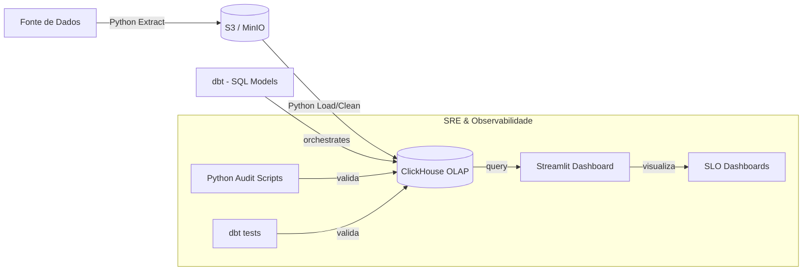

# System Design & Technical Narrative

## Design Principles (BASS & ATAM Alignment)

> **⚠️ Contexto importante:** O modelo de dados real consiste em **apenas uma tabela de pedidos** no S3. O design abaixo reflete essa adaptação.

O design deste sistema foi guiado pelos princípios de **Software Architecture in Practice (Bass)**, focando em Atributos de Qualidade (QAs), e validado através de considerações **ATAM** para equilibrar tradeoffs técnicos.

### 1. Estratégia de Ingestão (Performance & Testability)
Utilizamos o padrão **S3-as-a-Buffer**. O script Python atua como um orquestrador leve que apenas sinaliza ao ClickHouse a localização dos dados.
- **BASS**: Foco em *Performance*. Ao evitar o tráfego de dados pelo runtime do Python, reduzimos a latência de rede e o consumo de memória.
- **ATAM Tradeoff**: Sacrificamos a flexibilidade de pré-processamento em Python (que seria mais lento) em favor da velocidade bruta de carga do ClickHouse.

### 2. Camadas de Dados (Modifiability & Reliability)
- **Raw (Landing)**: CSVs originais no S3 (`raw/data_teste_atualizado.csv`). Imutabilidade garante que possamos re-testar qualquer cenário.
- **Trusted (Staging)**: Onde o dbt realiza o cast de tipos e renomeia colunas (`stg_pedidos`).
- **Curated (Analytics)**: Modelos dimensionais prontos para o Streamlit (`dim_orders`, `fact_order_status`).

---

## 1. Diagrama de Fluxo (Mermaid)

## 2. Narrativa do Design
O sistema utiliza o **Streamlit** como sua camada de visualização primária. 

A escolha do Streamlit (Python) em vez de ferramentas de BI tradicionais permite uma integração profunda com o ecossistema SRE do projeto. Os dashboards não apenas mostram vendas, mas também o status de integridade dos dados, resultados dos `dbt tests` e métricas de SLO em tempo real, tudo codificado em Python puro. O Streamlit consome os dados diretamente das camadas Curated do **ClickHouse**, garantindo que a visualização seja sempre baseada na "Single Source of Truth".
