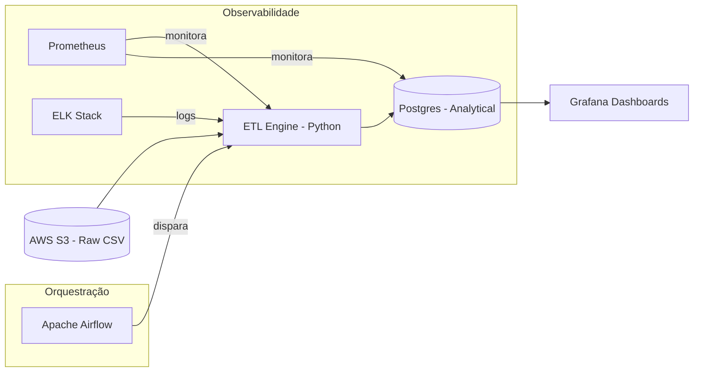

# System Design

## 1. Diagrama de Fluxo (Mermaid)

## 2. Narrativa do Design
O sistema foi desenhado para ser resiliente e escalável. A ingestão inicia-se com o Airflow disparando o container de ETL. Este container baixa os dados do S3, valida o hash do arquivo contra uma tabela de controle (`etl_control`) para garantir idempotência e processa os dados usando Pandas. O carregamento final utiliza a estratégia de `upsert` no Postgres para evitar duplicatas em nível de registro. Todo o processo é monitorado pelo Prometheus, enviando alertas em caso de falha ou degradação de performance (SLOs).
