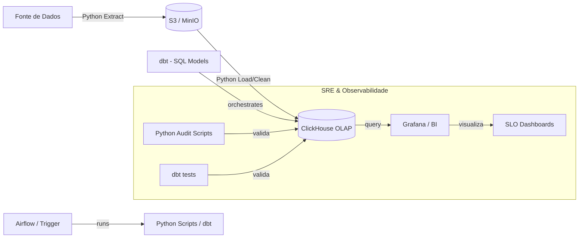

# System Design

## 1. Diagrama de Fluxo (Mermaid)

## 2. Narrativa do Design
O sistema é um híbrido de **Python** e **Modern Data Stack**. 

Python é a "cola" do sistema, sendo utilizado para:
1. **Ingestão**: Scripts Python customizados para lidar com APIs ou arquivos brutos (Extract).
2. **Qualidade e SRE**: Scripts Python que realizam auditoria de checksums, validação de PII (dados sensíveis) e scripts de "Chaos Engineering" para testar a resiliência do ClickHouse.
3. **Transformações Complexas**: Antes da carga no ClickHouse, o Python (via Polars/Pandas) pode realizar limpezas que seriam ineficientes em SQL.

O **dbt** entra na sequência para gerenciar a camada puramente analítica dentro do ClickHouse, garantindo que o SQL de negócio seja versionado e testado. Esta combinação oferece o melhor dos dois mundos: a flexibilidade do Python para infraestrutura e SRE, e a potência do SQL/dbt para modelagem de dados.
